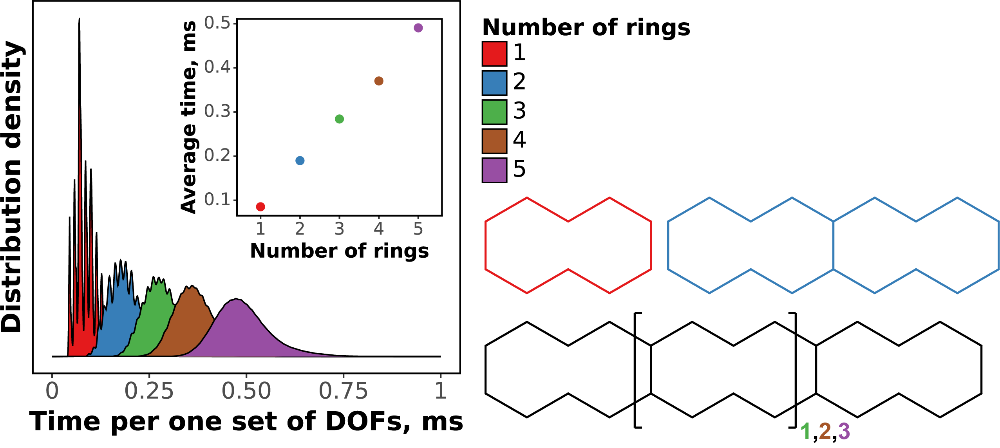

# Ringo –⁠ A Python Library for Kinematics-Driven Conformer Generation

## Boosting conformational search of (poly)cycles with kinematics

Conformational search can be a challenging task, but one approach to simplify it is to assume that bond lengths and valence angles remain constant as conformations change. This leads to a geometric approach to conformational search, where conformations differ from each other in their dihedral angles only. One common way of sampling is to assign random values to all non-cyclic dihedrals in the molecule, but this method does not work for cyclic molecules since changing one or several torsion angles in the cycle will almost certainly distort bond lengths and bond angles. This is where inverse kinematics can be useful.

Inverse kinematics allows to consider the cycle as a set of connected joints with fixed lengths and angles at the connections. Within this kinematic model, it is possible to formulate a mathematical criterion for closedness of the cycle. Inverse kinematics is the process of calculating the local parameters of each joint so that the kinematic chain achieves the required configuration. In practice, inverse kinematics can be useful for any conformational search algorithm that involves varying dihedral angles in arbitrary cyclic frameworks while keeping bond lengths and valence angles fixed. By using inverse kinematics, we can ensure that the resulting conformations are physically realistic and consistent with the connectivity of the molecule.

`Ringo` is a Python library that uses inverse kinematics to analyze the conformational flexibility of (poly)cyclic molecules by identifying independently rotatable dihedral angles of the molecule, and generate conformers when these values are chosen. `Ringo` also provides a back-end for identification and manipulation of degrees of freedom of cyclic molecules, i.e. setting their values to generate corresponding conformations. `Ringo`'s algorithm processes one set of dihedral angle values in fractions of a millisecond and scales well with number of rings in the molecule (see figure below), allowing for efficient and comprehensive conformational searches of polycyclic molecules.



## Installation

Precompiled version of `Ringo` is avalable for Linux (Python >= 3.7) and Windows (Python >= 3.8) via PyPi repository

```
pip install ringo-ik
```

## Build Ringo from source

1. Install prerequisites: `numpy` and `networkx` (`rdkit` is also required for generation from SMILES)

```bash
conda install numpy networkx
# Optional:
conda install -c conda-forge rdkit
```

2. Clone the repo and run the build script and install:

```bash
git clone --recurse-submodules https://github.com/TheorChemGroup/Ringo.git
cd ringo/release_assemble
python release_assemble.py
cd ringo_release
pip install .
```

The build is done with default set of flags (`-eweak` for geometry validation enabled only for final geometries). However, it's easy to customize build flags within `linux_assemble.py` script for purpose of benchmark and testing:

- `-e`: flag for end-to-end testing that enables all intermediate and final checks that geometry constraints are satisfiled in obtained structures.
- `-eweak`: (__recommended__) enable the final check that geometry constraints are satisfiled in obtained structures.
- `-disable-overlaps`: turn off overlap detection.

3. Check that the library can be imported successfully and example scripts are working:

```bash
python
> import ringo
> quit()
cd ringo/release_assemble/example_scripts
python run_ringo.py
```

## What Ringo does under the hood?

Ringo utilizes inverse kinematics to analyze the conformational flexibility of (poly)cyclic molecules. By identifying independently rotatable dihedral angles of the molecule, Ringo can generate its conformations when values of degrees of reedom are specified. The `Molecule` class is at the heart of Ringo's functionality, providing a simple interface for manipulating a molecule's degrees of freedom. The `Molecule` object can be initialized with either an SDF file (starting conformer is required) or NetworkX graph (starting conformer is not required) which both provide all necessary structural and bonding information of the molecule. Calling the `get_ps` method returns a list of degrees of freedom tuples and their corresponding values as a numpy array (`get_discrete_ps` returns a similar set of discrete DOFs, i.e. IK solution indices). New values of these degrees of freedom can be assigned to the numpy array and set via `apply_ps` method to generate new conformations. For more details see [example](./release_assemble/example_scripts/run_ringo.py). 
<!-- For initialization from SMILES see [this example](./release_assemble/example_scripts/run_ringo_from_smiles.py). -->

## Documentation

- `Molecule(sdf_filename='foo.sdf' or graph_data=dict(...))`

Initializes an instance of the `Molecule` class. No copy constructor is available. The molecule is initialized either from an SDF file or from NetworkX graph (without starting conformer). This mode of initialization requires all cyclic fragments to be kinematically flexible so that TLC can be applied.
`graph_data` should contain the following two keys for details <!-- (see [example](./release_assemble/example_scripts/run_ringo_from_smiles.py) --> on "xyzless" initialization, note that it is not compatible with parallel execution for now):

1. `graph: networkx.Graph`: Molecular graph with nodes representing atoms and edges representing bonds. Each node must contain attributes `'symbol': str` and `'poly': Polyhedron`. Each edge must contain attribute `'length'`.

2. `fixed_dihedrals: dict`: Dict of values of all fixed dihedrals in degrees (double and triple bonds). If dihedral is not provided in this list, it will automatically be assigned `0.0` (a warning will be printed). Indexing of atoms starts with 1. Example of `fixed_dihedrals`:
```python
'fixed_dihedrals': {(1, 2, 3, 4): -90.0, (5, 6, 7, 8): 10.0}
```

### Conformer manipulation

`Confpool` is a class can be used to store the conformers generated by Ringo. But it is also a flexible class for processing of conformer ensembles. See [PyXYZ repository](https://gitlab.com/knvvv/pyxyz) for details.

## Reference for C++ functions

This section covers more advanced interfaces directly to C++ functionality of the library, it will be most useful for developers who use `Ringo` as back-end of conformer generation pipeline.

### `Molecule` class – the backend for conformer generation

- `Molecule()`

Initializes an instance of the `Molecule` class. Only empty constructor is available (no copying).

- `sdf_constructor(sdf_filename: str, nx: module, pyutils: module) -> None`

Initializes a `Molecule` object from an SDF file. Technically this is not a constructor more like an initializator.

- `graph_constructor(input_data: dict, nx: module, pyutils: module) -> None`

Initializes a Molecule instance without starting conformer, from a dictionary `input_data`. This mode of initialization requires all cyclic fragments to be kinematically flexible so that TLC can be applied. `input_data` should contain the following two keys:

1. `graph: networkx.Graph`: Molecular graph with nodes representing atoms and edges representing bonds. Each node must have attributes `'symbol': str` and `'poly': Polyhedron` <!-- (see [example](./release_assemble/example_scripts/run_ringo_from_smiles.py)). -->

2. `fixed_dihedrals: dict`: Dict of values of all fixed dihedrals in degrees (double and triple bonds). If dihedral is not provided in this list, it will automatically be assigned `0.0` (a warning will be printed). Indexing of atoms starts with 1. Example of `fixed_dihedrals`:
```python
'fixed_dihedrals': {(1, 2, 3, 4): -90.0, (5, 6, 7, 8): 10.0}
```

- `get_ps() -> tuple(list, numpy.ndarray)`

Generates array for input values of degrees of freedom of the molecule. This method must be called before `apply_ps` call. Returns a tuple of two items:

1. `dofs_list: list`: list of 4-element tuples. i-th tuple contains atom indices of the corresponding dihedral angle.

2. `dofs_values: numpy.ndarray`: 1D numpy array of doubles. i-th element is the value of the corresponding dihedral in radians. In case of initialization from SDF, these values are set to current values of dihedral. In case of initialization from molecular graph, all free degrees of freedom are set to `0.0`.

- `get_discrete_ps() -> tuple(list, numpy.ndarray)`

Generates array for input values of discrete degrees of freedom of the molecule (i.e. indices of inverse kinematics solutions). This method must be called before `apply_ps` call. Returns a tuple of two items:

1. `dofs_list: list`: list of lists of integers. i-th list contains indices of atoms the corresponding cycle.

2. `dofs_values: numpy.ndarray`: 1D numpy array of integers. i-th element is the value of the corresponding discrete DOF. Normally, all discrete DOFs should be set to `-1` (calls for random choice whenever the number of solutions will be known).

- `apply_ps() -> int`

Applies the values of degrees of freedom set in `dofs_values` numpy arrays to generate a new conformation of the molecule. Functions `get_ps` and `get_discrete_ps` must be called prior to `apply_ps` call. Return value indicates the outcome of the assembly attempt; it can be translated from integer into message using this mapping: 

```python
APS_RESULTS = {
    0: "Conformer generated successfully",
    1: "No solutions of inverse kinematics for given DOFs",
    2: "TLC failed to enforce the correct valence angles", # This error happens but very rarely
    3: "Undesired overlap detected",
    4: "Validation of the obtained geometry has failed"
}
```

- `get_xyz() -> numpy.ndarray`

Returns a numpy array with the current Cartesian coordinates of the molecule.

- `get_symbols() -> list`

Returns a list of atom symbols in the molecule.

## Contact information

* Nikolai V. Krivoshchapov – nikolai.krivoshchapov@gmail.com
* Michael G. Medvedev – medvedev.m.g@gmail.com

## License

This work is licensed under a [Creative Commons Attribution-NonCommercial-ShareAlike 4.0 International License][cc-by-nc-sa].

[![CC BY-NC-SA 4.0][cc-by-nc-sa-image]][cc-by-nc-sa]

[cc-by-nc-sa]: http://creativecommons.org/licenses/by-nc-sa/4.0/
[cc-by-nc-sa-image]: https://licensebuttons.net/l/by-nc-sa/4.0/88x31.png
[cc-by-nc-sa-shield]: https://img.shields.io/badge/License-CC%20BY--NC--SA%204.0-lightgrey.svg
